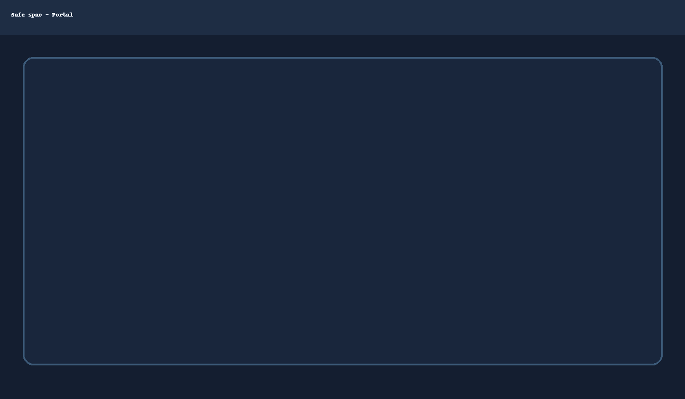
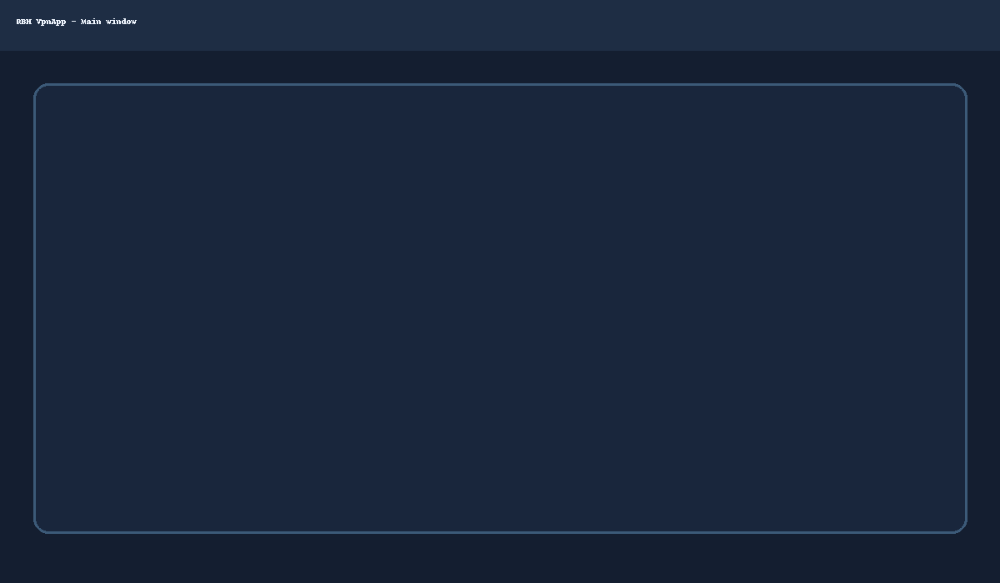

# Safe spac

Opis projektu.


## Zrzuty ekranu

<p align="center">
  
  
</p>
<p align="center">
  
</p>

## Nowe funkcje
- **Desktop (Electron):** logowanie **OIDC PKCE** w systemowej przeglądarce (loopback `127.0.0.1:53123`) + wydawanie profilu przez `core-api`.
- **Rejestracja z akceptacją:** `/register` (składanie wniosków) oraz `/admin/pending` (lista + approve/reject).

### Dodatki bezpieczeństwa i UX (nowe)
- **Tailwind + shadcn-like** komponenty w WebApp (vendored, bez zewn. CLI).
- **Polityka haseł** (min. 10 znaków, wielka/mała litera, cyfra) + opcjonalna walidacja **HIBP offline** (włącz przez `HIBP_CACHE=/data/hibp_cache`).
- **Rate limiting** per-IP oraz **CAPTCHA** (prosta matematyczna, HMAC) na `/register` i `/invite/accept`.
- **Audit log** w `/data/audit.log` (CSV): timestamp, action, actor, details.
- **Email z zaproszeniami** przez SMTP (`SMTP_HOST, SMTP_PORT, SMTP_USER, SMTP_PASS, SMTP_FROM`).  
- **Wymuszenie TOTP** przed wydaniem profilu: `wg-provisioner` sprawdza `amr` zawiera `totp`.
## CI: WebApp Docker (GHCR)
- Workflow: `.github/workflows/build-webapp.yml`
- Publikuje obraz do `ghcr.io/<org>/safe-spac-webapp:latest` oraz tagu z releasu; dołącza `webapp-image.tar` jako artefakt.

## HIBP cache
- Skrypt: `tools/hibp-build.sh` — buduje k-anonimity cache z pliku `pwned-passwords-sha1-ordered-by-hash.txt`.
- Użycie w Core API: ustaw `HIBP_CACHE=/data/hibp_cache`.

## Audit log — podgląd
- Endpoint: `GET /api/core/admin/audit` (ostatnie 500 wierszy).
- UI: `/admin/audit` — tabela + filtr tekstowy.
## Wdrożenie (krok po kroku)
1. **VPS (Debian 12)** – zaloguj się na `root` i uruchom:
   ```bash
   curl -fsSL https://example.com/install_vps.sh -o install_vps.sh  # lub skopiuj z repo
   bash install_vps.sh
   ```
   Podaj domenę (np. `portal.example.com`). Skrypt postawi: Traefik (TLS/LE), Authelia (OIDC + 2FA), WireGuard (wg0/wg1 + Tor), Ghost, Gitea, TeamSpeak 6 i nasze serwisy (`core-api`, `wg-provisioner`, `webapp`).

2. **Authelia** – w panelu włącz **TOTP** jako wymagane; nasze serwisy wymuszają `amr=totp` dla wydawania profili VPN.

3. **Repo / CI** – taguj wersje (`vX.Y.Z`), GitHub Actions zbuduje i opublikuje obrazy do **GHCR**:
   - WebApp: `ghcr.io/<org>/safe-spac-webapp`
   - Core API: `ghcr.io/<org>/safe-spac-coreapi`
   - Provisioner: `ghcr.io/<org>/safe-spac-provisioner`
   Artefakty (`*.tar`) będą też załączone do Release.

4. **HIBP (opcjonalnie)** – pobierz `pwned-passwords-sha1-ordered-by-hash.txt` i uruchom:
   ```bash
   tools/hibp-build.sh /ścieżka/pwned-passwords...txt /opt/safe-spac/hibp_cache
   ```
   Ustaw w `core-api`: `HIBP_CACHE=/opt/safe-spac/hibp_cache`.

5. **SMTP (opcjonalnie)** – ustaw w `core-api`:
   `SMTP_HOST, SMTP_PORT, SMTP_USER, SMTP_PASS, SMTP_FROM` – zaproszenia będą wysyłane z `/admin/invite`.

6. **Klienci** – Windows: installer `.exe` (Inno Setup / Electron builder) pobiera WireGuard i TS6, Linux: `.AppImage` + `bootstrap.sh`.

## Opis funkcji (modułów)
- **WebApp (Next.js)**: `/` feed, `/register` wnioski, `/invite/[token]` zaproszenia, `/app` panel usera, `/app/change-password` zmiana hasła, `/admin/*` admin (pending/invite/audit/health).
- **Core API (Go/Fiber)**: rejestracja + zaproszenia, polityka haseł + HIBP, CAPTCHA + rate limit, audit log, Authelia provisioning, proxy do provisionera, health agregacja.
- **WG Provisioner (Go/Fiber)**: wydawanie profili WireGuard (normal/tor × split/full), kontrola ról i `amr=totp`.
- **Desktop (Electron)**: OIDC PKCE (loopback), auto-refresh tokenów, UI wyboru profilu, tray; buildy `.exe`/`.AppImage` w CI.
- **Infra (Traefik + Authelia + Docker)**: TLS/LE, SSO 2FA, segmentacja sieci (wg0/wg1), tylko-VPN dla TS6 i Gitea.

